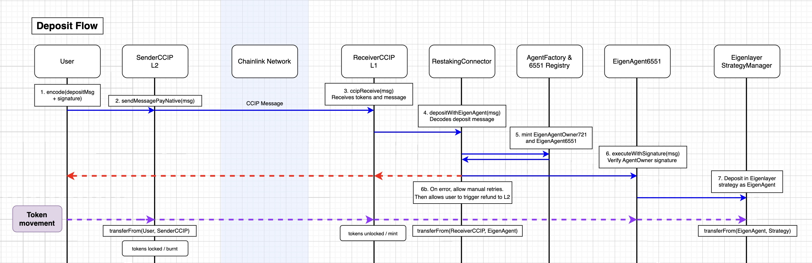
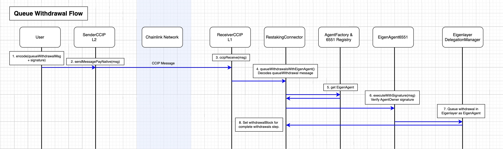
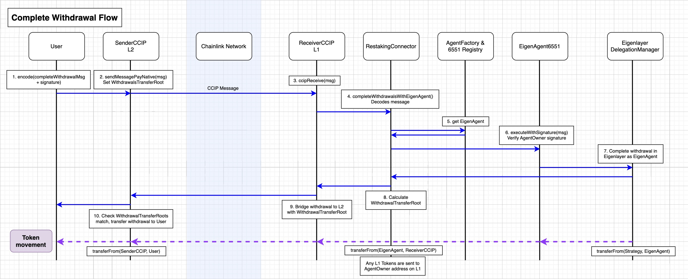
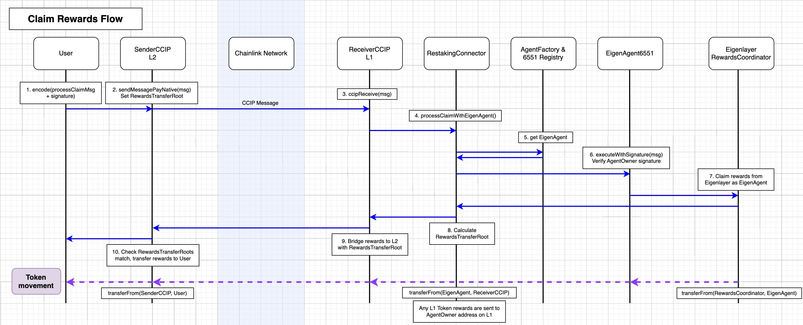
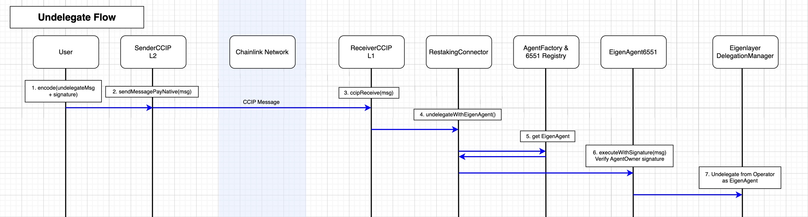
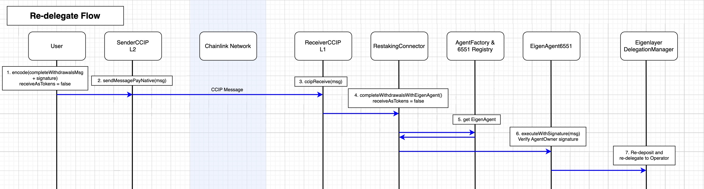

# L2 Eigenlayer Restaking via ERC-6551 accounts

This repo routes contract calls through user-owned 6551 accounts to deposit into Eigenlayer from L2.

Eigenlayer does not allow ThirdParty withdrawals, users must use their wallets to deposit and withdraw funds. So we cannot withdraw on behalf of our users via L1 bridge contracts. Using 6551 proxies addresses this restriction.

This also keeps custody of funds with the user (who owns the 6551 NFT) and gives them an escape option to withdraw funds on L1.


### Table of Contents
- [Running Tests and Restaking Scripts](#running-tests-and-restaking-scripts)
- [Sepolia L2 Restaking Example](#sepolia-L2-restaking-example)
    - [1. Deposit with EigenAgent](#deposit-with-eigenagent)
    - [2. QueueWithdrawals with EigenAgent](#queue-withdrawals-with-eigenagent)
    - [3. CompleteWithdrawal with EigenAgent](#complete-withdrawal-with-eigenagent)
    - [4. Claim Rewards with EigenAgent](#claim-rewards-with-eigenagent)
    - [5. Delegate to an Operator with EigenAgent](#delegateTo-with-eigenagent)
    - [6. Undelegate with EigenAgent](#undelegate-with-eigenagent)
    - [7. Redeposit with EigenAgent (re-delegate)](#redeposit-with-eigenagent)
- [ERC-6551 EigenAgents](#ERC-6551-eigenagents)
- [Todo Features](#todo-features)


<a name="running-tests-and-restaking-scripts"/>

### Running Tests and Restaking Scripts

The following test will bridge from L2 to L1, deposit in Eigenlayer, queueWithdrawals, completeWithdrawal, then bridge back to the original user on L2.
```
forge test --match-test test_FullFlow_CompleteWithdrawal -vvvv
```

The following test will teset delegating, undelegating, and re-depositing:
```
forge test --match-test test_FullFlow_Undelegate_Delegate_Redeposit -vvvv
```

See test coverage (there is an `lcov.info` file for coverage as well):
```
forge coverage
```

Frontend clients will make contract calls similar to the scripts in the `scripts` folder. These scripts run on Base Sepolia and dispatches CCIP calls to Eth Sepolia, bridging `CCIP-BnM` ERC20 tokens and interacting with mock Eigenlayer Strategy Vaults setup for the `CCIP-BnM` token.

To run the Scripts see the `scripts` folder:
- `5_depositAndMintEigenAgent.sh`: makes a cross-chain deposit into Eigenlayer from L2, minting an EigenAgent if the use does not yet have one.
- `7_queueWithdrawal.sh`: queues a withdrawal from L2.
- `8_completeWithdrawal.sh`: completes the withdrawal and bridges the deposit back from L1 into the original staker's wallet on L2.
- `9_submitRewards.sh`: sets up token emission rewards for the week, however can only be down once per epoch (weekly)
- `9b_processClaimRewards.sh`: claims token emissions rewards for the user and bridges tokens back to L2 user.


Scripts `2_deploySenderOnL2.s.sol`, `3_deployReceiverOnL1.s.sol` and `4_whitelistCCIPContracts.sh` deploy the CCIP bridge contracts, and 6551 and Eigenlayer Restaking handler contracts.

There are `2b` and `3b` upgrade scripts which need to be run when changes made to either the `SenderCCIP`, `ReceiverCCIP`,`RestakingConnector`, `SenderUtils`, `AgentFactory` or `EigenAgentOwner721` contracts.

The following scripts will test delegation:
- `6_delegateTo.sh` delegates to an Operator
- `6b_undelegate.sh` undelegates from an Operator and begins a cooldown period (7 days on mainnet)
- `6c_redeposit.sh` re-deposits shares into Eigenlayer and allows the user to re-delegate to another Operator.
Everytime a user undelegates, there is a cooldown timer.


Bridging times depend on the finality times of source and destination chains.
It currently takes +20 minutes to bridge a message [Base and ZkSync has finality times of 20min, ETH is 15min](https://docs.chain.link/ccip/concepts/ccip-execution-latency#finality)


<a name="sepolia-L2-restaking-example"/>

## Sepolia L2 Restaking Example

<a name="deposit-with-eigenagent"/>

### 1. Deposit with EigenAgent

We first bridge `0.0619` tokens from L2 to L1 with a message to mint an ERC-6551 EigenAgent and forward a  `DepositIntoStrategy` [message to Eigenlayer](https://ccip.chain.link/msg/0x5e37d8f0b80d3c489fb8fcc5bd00d761b47eeee214e3b06cb564484a9841914d), resulting in `Deposit` and 6551 EigenAgent [minting events](https://sepolia.etherscan.io/tx/0xc13273ab04e87f91b30eeac7d2ed23979904aec02cb1e090f1a85596e2fbb497).

We can see tokens routing through the [6551 EigenAgent contract here](https://sepolia.etherscan.io/address/0x2fd5589daa0eb790b9237a300479924f9023efef#tokentxns).

```
Cost: 0.014686 ETH on Sepolia at 20.27 GWEI (724,221 gas)
approx. $38

Assuming 10 GWEI on mainnet: 0.00724 ETH
Assuming 30 GWEI on mainnet: 0.0217 ETH
```


See [Tenderly transaction for an execution trace](https://dashboard.tenderly.co/tx/sepolia/0xc13273ab04e87f91b30eeac7d2ed23979904aec02cb1e090f1a85596e2fbb497).




<a name="queue-withdrawals-with-eigenagent"/>

### 2. Queue withdrawals with EigenAgent

Users can send their EigenAgent a [QueueWithdrawal message](https://ccip.chain.link/msg/0x10a92b6dd245be98abc86ffa9e1192b201533c828763ecb94bffd3d2213ec165) to withdraw, producing [WithdrawalQueued events on L1](https://sepolia.etherscan.io/tx/0x41a6ba16229e2bd0e9db2f9bd632139a9db4c0d6952dadb2812420a55e0bd215#eventlog).

After waiting for the unstaking period (7 days), users can complete withdrawals.
- Queued withdrawals information are stored in `script/withdrawals-queued/<user_address>/`
- Completed withdrawals information are stored in `script/withdrawals-completed/<user_address>/`.




<a name="complete-withdrawal-with-eigenagent"/>

### 3. Complete withdrawal and bridge back to owner on L2

Sending a [CompleteWithdrawal message from L2](https://ccip.chain.link/msg/0x6d8674ca7afaf314f69c17faffe178ac897d822f897d5aeea101c1c9ee97afca) executes on L1 with the following Eigenlayer [WithdrawalCompleted events](https://sepolia.etherscan.io/tx/0xcadc91261a481bf82759face86821e77f6422c86ae01bf9cc4663dca73760f3a).

The L2 Bridge contract will automatically bridge the withdrawal back to L2 to the EigenAgent's owner. You can see the `messageId` here in `topic[1]` of the [MessageSent event](https://sepolia.etherscan.io/tx/0xcadc91261a481bf82759face86821e77f6422c86ae01bf9cc4663dca73760f3a#eventlog#115) which we can track in the CCIP explorer to see the [withdrawal bridging back from L1 to L2](https://ccip.chain.link/msg/0xf7f7b36465f640cad874fa7379757ff2ca42f513186db0a5218b5526f0ca5bec).

When the funds arrive on L2, the original `0.0619` tokens are [transferred to the EigenAgent owner's address](https://sepolia.basescan.org/tx/0xa6d2a4f2166c32b9d1f37a4b87d222b436405f546277c13525b02ea35f03b881).


Note: As EigenAgentOwner NFTs are transferrable, a user may try call `completeWithdrawal` then attempt to sell the NFT while the withdrawal is in flight. If users are trading these NFTs they need to be careful about this.




<a name="claim-rewards-with-eigenagent"/>

### 4. Claim Rewards from L2

You can also claim staking rewards by [sending a processClaim message from L2](https://ccip.chain.link/msg/0xf4b4e2ca7753f29f363c2566011d090ab39259890ef965e6ab163b83469053b5). The rewards are [bridged back to L2 to the EigenAgent owner](https://ccip.chain.link/msg/0x1eb6bbbc8080f30b516d5a0194e25a2c3fdbe6bff9fba207179e84b4aa20feee). Only the bridge token will be bridged back to L2. Other ERC20 reward tokens will be sent to the EigenAgent owner's wallet on L1.




<a name="delegateTo-with-eigenagent"/>

### 5a. Delegate to an Operator

You can delegate to Operators, by sending a [delegateTo message](https://ccip.chain.link/msg/0x952b6d0e36dd9121ab7e0142f916d562c933fb3a5b2268ec7f87d355a709c482), resulting in the following [delegation events](https://sepolia.etherscan.io/tx/0xe9d1e9a6c5571e147858beb60909a74ee5b9463ae7601ce76093341b28a77686#eventlog).


<a name="undelegate-with-eigenagent"/>

### 5b. Undelegate from an Operator

If a user wants to switch Operators to delegate to, they can send a [undelegate message](https://ccip.chain.link/msg/0xd88d55c9b01de1eaa64fedc123358191cd863de08e7784701d7268120249c25d) which results in the following [undelegate events](https://sepolia.etherscan.io/tx/0x0220fa337ca1fc33de0048bb7f0b15dd5ca3ae56efe7a45cab336d72745df5f1).

Undelegating queues the staker for withdrawal and produces `withdrawalRoots`.
Front-end clients should keep track of the withdrawal information and `withdrawalRoots` as they will be needed to re-deposit later.



<a name="redelegate-with-eigenagent"/>

### 5c. Re-delegate to an Operator (re-depositing)

After undelegating, users wait 7 days then delegate to another Operator.
Then can re-deposit back into Eigenlayer with a [redeposit Message](https://ccip.chain.link/msg/0x539643e769b7e975ac3c7109fbac5350e73974d5e8f7c9dd2161be7d119fa4f0), which results in the following [re-deposit (WithdrawalCompleted) events](https://sepolia.etherscan.io/tx/0x52b5b3dda3975771524072c4d2762a768550faec69c6f6f8067a23af79f47a7c).

Re-depositing uses the same function calls as `completeWithdrawals`.
The `receiveAsTokens` flag in `completeWithdrawals` call determines whether user will:
1. Receive withdrawals as tokens (which are bridged back to L2), or
2. Receive withdrawals as shares in the vault (which can be re-delegated).

There is no way to directly re-delegate to another operator, a staker must undelegate + withdraw, wait 7 days, then restake and re-delegate to a new operator.




<a name="ERC-6551-eigenagents"/>

## ERC-6551 EigenAgents

EigenAgent accounts will only execute calls if the signature came from the user who owns the associated EigenAgentOwner 721 NFT.
See: [https://eips.ethereum.org/EIPS/eip-6551](https://eips.ethereum.org/EIPS/eip-6551)

Each user can only have 1 EigenAgentOwner NFT at the moment. We can make them tradeable or soulbound.

EigenAgent accounts are ERC1967 Proxies and can be upgraded. We can also look at BeaconProxy implementation if we want upgradeability for all accounts (Agents just route contract calls, so upgradeability is not strictly needed).

EigenAgentOwner NFTs are minted via the AgentFactory (which talks to a 6551 Registry and keeps track of EigenAgent 6551 accounts and ownership).

Cost of deploying EigenAgent should be manageable (can swap for ERC1167 minimal proxies):
```
forge test --match-test test_step5c_MintEigenAgent -vvvv --gas-report
```

Note: at the moment you cannot have more than 1 cross-chain message in-flight at a time because the execution nonce will be stale, causing the EigenAgent execution signature to fail for the 2nd message.
- CCIP bridging takes ~20min (Ethereum finality takes ~12.8 min)
- A solution is to track in-flight txs and increment nonces on the client-side for subsequent messages (at least until the messages successfully execute on L1). Note this assumes CCIP messages land on L1 in the correct order.


<a name="todo-features"/>

## Todo Features

- [x] Cross-chain messages for EigenAgent to execute Eigenlayer actions:
    - [x] `depositIntoStrategy`
        - [x] Catches deposit reverts, and allow manual re-execution to trigger refund after expiry (in case target Operator goes offline while deposits are in-flight from L2).
    - [x] `queueWithdrawals`
    - [x] `completeQueuedWithdrawals`
        - [x] Transfer withdrawn tokens back to L2.
        - [x] Transfer L1 tokens to AgentOwner address on L1.
    - [x] `delegateTo`
    - [x] `undelegate`
    - [x] `re-deposit` into Eigenlayer (and re-delegate).
    - [x] `processClaim` staking rewards, and bridge rewards back to owner on L2.
        - [x] Transfer bridgeable rewards tokens back to L2.
        - [x] Transfer L1 rewards tokens to AgentOwner address on L1.

- [ ] Gas optimization
    - [x] Estimate gas limit for each of the previous operations
    - [x] Reduce gas costs associated with 6551 accounts creation + delegate calls
        - [ ] Remove proxies if we don't need upgradeability.

- [ ] Chainlink to setup a "lane" for CCIP bridges:
    - [ ] Setup Chainlink lanes on Holesky and target L2.
    - [ ] Adapt differences in bridging model (mint/burn vs lock/mint) for target chain.
